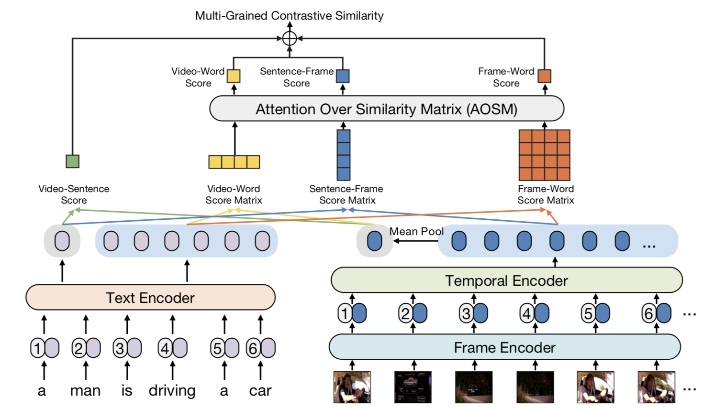

# X-CLIP: End-to-End Multi-grained Contrastive Learning for Video-Text Retrieval

## Introduction

The implementation of paper [X-CLIP: End-to-End Multi-grained Contrastive Learning for Video-Text Retrieval](https://arxiv.org/abs/2207.07285 "X-CLIP: End-to-End Multi-grained Contrastive Learning for Video-Text Retrieval"). Accepted by ACMMM22. By [Yiwei Ma](https://github.com/xmu-xiaoma666 "Yiwei Ma"), [Guohai Xu](https://scholar.google.com/citations?user=bS8Ku4MAAAAJ\&hl=en "Guohai Xu"), [Xiaoshuai Sun](https://scholar.google.com/citations?user=KPMK3B4AAAAJ\&hl=en "Xiaoshuai Sun")\*, [Ming Yan](https://scholar.google.com/citations?user=uIUfGxYAAAAJ\&hl=zh-CN "Ming Yan"), [Ji Zhang](https://scholar.google.com/citations?user=cgnuJDUAAAAJ\&hl=zh-CN "Ji Zhang"), [Rongrong Ji](https://scholar.google.com/citations?user=lRSD7PQAAAAJ\&hl=en "Rongrong Ji").


X-CLIP adopts cross-grained contrastive learning and attention over similarity matrix module to filter out unnecessary information during video-text retrieval. It achieves SOTA results on MSR-VTT, MSVD, LSMDC, DiDeMo, and ActivityNet.

<!--  -->


## News

*   **2022.09.20**: Released code

## Requirement

*   [PyTorch](https://pytorch.org/ "PyTorch") version = 1.7.1

*   Install other libraries via

```bash
pip install -r requirements.txt
```

## How to Run

（1）About data download

Please refer to the guides from [CLIP4Clip: Data Preparing](https://github.com/ArrowLuo/CLIP4Clip#:~:text=Data-,Preparing,-For%20MSRVTT).


（2）About the pretrained CLIP checkpoints

You can find more pretrained models in [here](https://github.com/openai/CLIP/blob/main/clip/clip.py "here").

```bash
# download CLIP（ViT-B/32） weight
wget -P ./modules https://openaipublic.azureedge.net/clip/models/40d365715913c9da98579312b702a82c18be219cc2a73407c4526f58eba950af/ViT-B-32.pt

# download CLIP（ViT-B/16） weight
wget -P ./modules https://openaipublic.azureedge.net/clip/models/5806e77cd80f8b59890b7e101eabd078d9fb84e6937f9e85e4ecb61988df416f/ViT-B-16.pt
```


（3）About the running scripts

**MSR-VTT**

```bash
# ViT-B/32
sh scripts/run_xclip_msrvtt_vit32.sh

# ViT-B/16
sh scripts/run_xclip_msrvtt_vit16.sh
```

**MSVD**

```bash
# ViT-B/32
sh scripts/run_xclip_msvd_vit32.sh

# ViT-B/16
sh scripts/run_xclip_msvd_vit16.sh
```

**LSMDC**

```bash
# ViT-B/32
sh scripts/run_xclip_lsmdc_vit32.sh

# ViT-B/16
sh scripts/run_xclip_lsmdc_vit16.sh
```

**DiDeMo**

```bash
# ViT-B/32
sh scripts/run_xclip_didemo_vit32.sh

# ViT-B/16
sh scripts/run_xclip_didemo_vit16.sh
```

**ActivityNet**

```bash
# ViT-B/32
sh scripts/run_xclip_actnet_vit32.sh

# ViT-B/16
sh scripts/run_xclip_actnet_vit16.sh
```

## Citation

If you find our method useful in your work, please cite:

```python
@article{Ma2022XCLIP,
  title={{X-CLIP:}: End-to-End Multi-grained Contrastive Learning for Video-Text Retrieval},
  author={Yiwei Ma and Guohai Xu and Xiaoshuai Sun and Ming Yan and Ji Zhang and Rongrong Ji},
  journal={arXiv preprint arXiv:2207.07285},
  year={2022}
}
```

## Acknowledgments

The implementation of X-CLIP relies on resources from [CLIP4Clip](https://github.com/ArrowLuo/CLIP4Clip "CLIP4Clip") and [CLIP](https://github.com/openai/CLIP "CLIP"). We thank the original authors for their open-sourcing.
